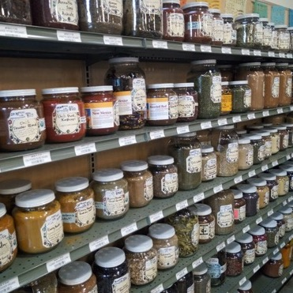
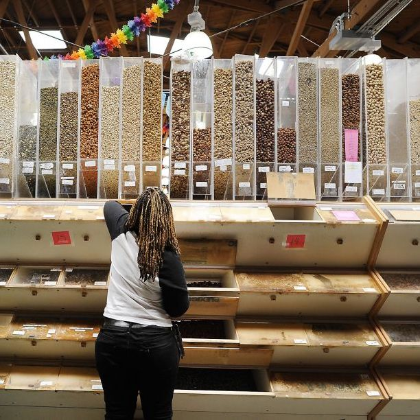

# Reverse Engineering Shopping Lists 
# The Problem: How can a grocery store analyze their customer's shopping without a loyalty program?

A large Bay-Area Natural Food store doesn’t have a method to analyze their customer's baskets.
They have been a fixture of San Francisco since 1975 and have a register system designed in the 80's.

* $1,000,000 in sale per week
* 25,000 square foot
* maintains a selection of 30,000 items
* 2000-3000 customer per day
* no loyalty program 

## Discovering customer types from transactions without a loyalty program!

Everyday the register spits out a giant raw text file (2000 printable pages) of the previous day's 2000-3000 transactions.

Is there a way to find some patterns of shopping in this run-on stream of text?

## Hello Non-Negative Matrix Factorization!

[NMF](https://en.wikipedia.org/wiki/Non-negative_matrix_factorization) is an unsupervised learning model that can be used to find topic similarity between documents based on the words they contain. Treating each transaction as a document and each item's **unique 13 character description** as a word I will discover the latent dimensions of shopping baskets hidden in this history of purchases.
 
## Step 1. Parse the Data

Using a regex file I found on the web, i modified it to parse the transactionlog.txt ('tlogs') into useable elements. Date, time, total, cashier, lane, items, price and department code were all waiting to be pulled from a consistently formatted text file.  I also had to account for stray punctuation characters in the item descriptions.
Writing the results into a json format allowed for them to be quickly read into a pandas dataframe. See the [makeJSONS.py](https://github.com/pablokimon/latent_customers/blob/master/src/makeJSONS.py) file.

## Step 2. Prepare the Item List and Dictionary

For the results below, I used all the transaction data from 2018, over 800,000 rows containing 30,000 unique items. All the following steps can be executed with the [latent_customers.py](https://github.com/pablokimon/latent_customers/blob/master/src/latent_customers.py) file.
The item data was extracted as a list of list which I iterated through, adding the item to a dictionary with a running count of the items, ultimately yielding a dictionary of all the items in the all the baskets, and their total count.  I developed a "stop words" list to remove common items which made basket similarities worse. Bag Credits and bottle deposits were linking too many baskets because they were present in many baskets but were not actual items that lend any insight into shopping habits.  

NOTE: Bananas were in 112832 of the 831284 baskets, roughly 1 in 8 baskets, or 13.5% of transactions and Hass Avocados were in 10% of baskets.
Removing both of these items allowed a greater differentiation between baskets. The next most prevalent item was "YELLOW ONIONS" which were in only ~7% of baskets and did not adversely affect results.

## Step 3. Building a Sparse Matrix

Because I needed the items descriptions to remain intact at the entire 13-character string, I built my own vectorizer. Each time an item was present in the basket, I added 1 for that item, for that transaction. If the value was negative (such as a voided item) I subtracted 1 for that item, for that transaction. This accounted for an item being rung up twice and voided once, for example. Iterating through the lists of transactions and adding a dictionary key for the row (transaction) and a tuple of the item and its count in the basket I built up a dictionary object, which was then passed to a sparse matrix.

## Step 4. Pass the Matrix to the NMF Model

Just before passing this sparse matrix to the NMF model, I set any negative values to 0. After choosing a value for the number of components (topics) and maximum iterations I let the NMF work its magic.  I returned from the model the number of iterations the model used to achieve the number of components specified, and the decomposed matrices W(rows of transactions, columns of topics) and H (rows of topics, columns of items).

## Step 5. Interpreting the model.

The values in W and H represent that item or transactions association or weight to that topic. The higher the number, the more weight that item or transaction contributes to that topic. Sorting these in descending order shows up the most related items and transactions for each topic.

## Step 6. What is the best number of topics?

To evaluate or score a topic modeler, we can compare the dot product of the resulting matrices W and H against the original matrix and evaluate the differences. With this specific type of data, increasing topics continued to slowly score better and better but the actual results of the increase topics were not an improvement, they got worse. By 10 topics, the top items were so blended between different topics that they were not easily differentiable. I settled on 7 topics for this data set and I encourage you to evaluate the number of components with math and your eye.

## Step 7. Interpreting the results.

Well it turned out I was not finding the customer types as I set out to, but I did discover these shopping dimensions, these grocery vectors that baskets can align along. When people go shopping, it is often with a specific, similar and repeated purpose. People shop for ingredients to make: soup, salsa and salad.

## Two Topics: People Who Cook and People Who Don't.

When I set the model to only sort into two topics, I found:

|  People Who Cook        69% of Baskets              | People Who Don't Cook        31% of Baskets               |
|--------------------|--------------------|
| ONIONS YELLOW      | APPLES FUJI        |
| GARLIC WHITE       | 1lb STRAWBERRY     |
| PEPPERS RED BELL   | ORANGES NAVEL      |
| LEMONS             | BROCCOLI LOOSE     |
| CELERY             | CARROTS BUNCH      |
| ONIONS RED         | BAGEL              |
| CARROTS LOOSE      | TOMATO DRY FARM    |
| GINGER             | CUCUMBERS          |
| SQUASH ZUCCHINI    | KALE DINO          |
| CILANTRO           | SPINACH LOOSE      |
| LIMES              | PEAR BARTLETT      |
| KALE DINO          | BEANS GREEN        |
| PEPPER CHILI       | 5290 WALNUTS       |
| MUSHROOM CRIMINI   | NECTARINE          |
| ONIONS GREEN       | ORANGES VALENCIA   |
| CUCUMBERS          | SATSUMA MANDARIN   |
| CARROTS BUNCH      | LETTUCE SALAD MIX  |
| PARSLEY ITALIAN    | REFRIGERATED       |
| BROCCOLI LOOSE     | ARUGULA LOOSE      |
| BEANS GREEN        | PEACH              |
| SPINACH LOOSE      | GRAPES RED         |
| POTATOES GARNET    | CARROTS LOOSE      |
| POTATOES YELLOW    | CUKE MEDIT/PERSIAN |
Etc...

## What does this tell us?

People tend to do shopping trips for produce to cook apart from trips of fruit, salad and bagels which don't need to be cooked.

## Splitting into 7 groups we find:

Seven groups gives us some pretty clear types of shopping trips:

 

 
| Stir-Fry Basket 59% | The Fruit Basket 8% | The Soup Basket 4% | Stir-Fry 2 Basket 6% |  The Kale Basket 7% | The Salad Basket 5%  | The Salsa Basket 11%  |
|--|-------------------|-------------------|-------------------|-------------------|-------------------|-------------------|
| PEPPERS RED BELL   | APPLES FUJI        | ONIONS YELLOW      | GARLIC WHITE       | LEMONS             | CELERY             | CILANTRO           |
| SQUASH ZUCCHINI    | ORANGES NAVEL      | POTATOES YELLOW    | GINGER             | LIMES              | CARROTS LOOSE      | PEPPER CHILI       |
| BROCCOLI LOOSE     | SATSUMA MANDARIN   | POTATOES RUSSET    | ONIONS RED         | KALE DINO          | CUCUMBERS          | LIMES              |
| BEANS GREEN        | PEAR BARTLETT      | POTATOES GARNET    | SHALLOTS           | PARSLEY ITALIAN    | KALE DINO          | ONIONS RED         |
| 1lb STRAWBERRY     | CARROTS BUNCH      | CARROTS BUNCH      | MUSHROOM CRIMINI   | HERBS BUNCH        | PARSLEY ITALIAN    | ONIONS GREEN       |
| CARROTS BUNCH      | PEAR BOSC          | MUSHROOM CRIMINI   | MUSHROOMS SHIITAKE | ORANGES VALENCIA   | BEETS RED LOOSE    | PARSLEY ITALIAN    |
| SPINACH LOOSE      | ORANGES VALENCIA   | LEEKS              | ROOT TURMERIC      | GRAPEFRUIT         | LEEKS              | HERBS BUNCH        |
| KALE DINO          | BAGEL              | PEPPERS GREEN BELL | ONIONS WHITE       | GINGER             | GINGER             | GINGER             |
| CUCUMBERS          | PERSIMMONS FUYU    | PARSLEY ITALIAN    | 5290 WALNUTS       | SHALLOTS           | BROCCOLI LOOSE     | TOMATOES ROMA      |
| MUSHROOM CRIMINI   | GRAPEFRUIT         | TOMATOES ROMA      | PARMIGIANO REGG    | ARUGULA LOOSE      | POTATOES YELLOW    | SHALLOTS           |
| LETTUCE SALAD MIX  | REFRIGERATED       | POTATOES JAPANESE  | KALE DINO          | CUCUMBERS          | ORANGES NAVEL      | RADISHES RED/FRENC |
| TOMATO DRY FARM    | 5290 WALNUTS       | SQUASH BUTTERNUT   | POTATOES GARNET    | APPLES, GRANNY SMI | APPLES, GRANNY SMI | CUKE MEDIT/PERSIAN |
| ARUGULA LOOSE      | 3185 ORG MANGO     | CABBAGE GREEN      | LEMONS MEYER       | 5290 WALNUTS       | CABBAGE RED        | CABBAGE RED        |
| PEACH              | BLUEBERRY          | SHALLOTS           | POTATOES YELLOW    | TOMATO MIX HEIRLOO | KALE GREEN         | DILL               |
| NECTARINE          | KIWI LOOSE         | POTATOES RED       | 5120 ORG ALMONDS   | ORANGES NAVEL      | POTATOES GARNET    | ONIONS WHITE       |
| CUKE MEDIT/PERSIAN | PEARS RED          | ORANGES NAVEL      | POTATOES JAPANESE  | NECTARINE          | CABBAGE GREEN      | CABBAGE GREEN      |

## But why is produce dominating the topics? What happened to all the other 30,000 items?

When someone buys a yellow onion there is one word for yellow onion: "ONIONS YELLOW ".
When they buy a loaf of bread, there are 50 different "words" for each loaf of bread.
Produce is popular and common, but because there are only about 200 produce items they will always dominate the topics.

## What happens when we remove the Produce items all together?

Something pretty amazing actually.
Ignoring any items from the produce department, we get these results:

| Bulk Nuts and Seeds 5% | Bagel and Cream Cheese 3%               | Ready to Eat Meals 3%               | Cheese, Milk, Eggs, Oats 83%               | Bulk Nuts and Seeds 2%               | 0Bulk Dried Fruits 2%               | Bulk Olive Bar 2%               |
|:-------------------|:-------------------|:-------------------|:-------------------|:-------------------|:-------------------|:-------------------|
| 5290 WALNUTS       | BAGEL              | REFRIGERATED       | PARMIGIANO REGG    | 5120 ORG ALMONDS   | 3185 ORG MANGO     | 2448 CASTEL OLIVE  |
| 5250 ORG PECAN HA  | OV CRM CHEESE SPRE | BAKERY             | 4110org rolledOATS | 5180 WHOLE CASHEWS | 3080 MEDJOOL DATES | 2553BLACK OIL CURE |
| 6645 SUNFLWR SEEDS | GINA MARIE CC      | INDIAN BENTO       | WHOLE ORG MILK     | 5250 ORG PECAN HA  | 3245 DRD PINEAPPLE | 2430 KALAMATA OLIV |
| 5132 R/NS ALMONDS  | OV CREAM CHEESE    | SPINACH PEASANT PI | 4110 ROLLED OATS   | 6645 SUNFLWR SEEDS | 3125 TURK APRICOT  | 2450 KALAMATA-PIT  |
| 5150or BRAZIL NUTS | NANCY'S ORGANIC CR | GLORIA'S WRAPS     | STRAUS PLN YOG QT  | 5161 CASHEW PIECES | 3174 ORG DR GINGE  | 2572 DOLMAS        |
| 3295  FLAME RAISIN | MORNING PASTRY/MUF | EPICUREAN          | 3680 BAKERS CH FLO | 6560  PUMPKIN SEED | 2887 ENERGY CHUNKS | BULK               |
| 6560  PUMPKIN SEED | SIERRA ORG CC TUB  | URBAN REMEDY       | 8161 ORG CUMIN PWD | 3080 MEDJOOL DATES | 2883 ENERGY CHUNKS | 2552 OLIVES wCUMI  |
| 5101 ROAST CASHEWS | BAKERY             | GLORIA'S BURRITO   | 6645 SUNFLWR SEEDS | 5277  RAW PISTACH  | 3285JACK FRUIT     | 6985 OLIVEANTIPAST |
| 5180 WHOLE CASHEWS | SCONES/MUFFINS     | PANGMU             | EGGS DZ ROCK LG    | 3295  FLAME RAISIN | 3740 BANANA CHIPS  | MARCONA ALMONDS    |
| 5161 CASHEW PIECES | SEMIFREDDIS BAGUET | LA CASCADA         | 3295  FLAME RAISIN | 5200 RAW HAZELNUTS | 5132 R/NS ALMONDS  | 2457 PICHOLINE OLV |
| 3290 THOMPSON RAIS | TOFUTTI PLAIN ''CH | PERFECT PAPAS      | 8571 TURM PWD ORG  | 5150or BRAZIL NUTS | 3175 SMYRNA FIGS   | 2332 HALF SOPICKLE |
| 5277  RAW PISTACH  | MONTEREY JACK CHEE | LENTIL SALAD       | 2580 NUTRI YEAST   | 3065 COCONUT FLAKE | 3110 DRD APPLE     | COWGIRL MT TAM     |
| 5150 BRAZIL NUTS   | ESTHERS PRETZELS   | ORGANIC CARROT 16  | PASTURE RAISED EGG | 5150 BRAZIL NUTS   | CALIFIA UNSWT      | 2530 NICOISES OLIV |
| 3144 OG DR CRANBER | SEMIFREDDIS LOAF   | SUPERFRESH SANDWIC | 5250 ORG PECAN HA  | 4111 CHIA SEEDS    | 3290 THOMPSON RAIS | 2455 OLIVE MEDLEY  |
| 4125 OG STL CUT OA | TILLY SHARP CHEDDA | PEASANT PIE GARBAN | DAVE'S KILLER      | 3290 THOMPSON RAIS | 5101 ROAST CASHEWS | ACME BAGUETTE      |

## Without produce, 10 topics looks a little better than 7:

| Bulk nuts and seeds 5%              | Bagel and Cream Cheese 3%               | Ready to eat meals 3%               | Oats seeds and spice 24%               | Nuts and seeds 2%               | Dried Fruit 2%              | Olive Bar 2%               | Milk, eggs, butter and cheese 57%               | Oats, beans and raisins 1%               | Morning pastry 2%               |
|:-------------------|:-------------------|:-------------------|:-------------------|:-------------------|:-------------------|:-------------------|:-------------------|:-------------------|:-------------------|
| 5290 WALNUTS       | BAGEL              | REFRIGERATED       | 4110 ROLLED OATS   | 5120 ORG ALMONDS   | 3185 ORG MANGO     | 2448 CASTEL OLIVE  | PARMIGIANO REGG    | 4110org rolledOATS | BAKERY             |
| 5250 ORG PECAN HA  | OV CRM CHEESE SPRE | INDIAN BENTO       | 6645 SUNFLWR SEEDS | 5180 WHOLE CASHEWS | 3080 MEDJOOL DATES | 2553BLACK OIL CURE | WHOLE ORG MILK     | 3295  FLAME RAISIN | SEMIFREDDIS        |
| 5132 R/NS ALMONDS  | GINA MARIE CC      | SPINACH PEASANT PI | 8161 ORG CUMIN PWD | 5250 ORG PECAN HA  | 3125 TURK APRICOT  | 2430 KALAMATA OLIV | STRAUS PLN YOG QT  | 2180 ORG BLK BEANS | MORNING PASTRY/MUF |
| 5150or BRAZIL NUTS | OV CREAM CHEESE    | GLORIA'S WRAPS     | 8571 TURM PWD ORG  | 5161 CASHEW PIECES | 3245 DRD PINEAPPLE | 2450 KALAMATA-PIT  | EGGS DZ ROCK LG    | 2195 ORG GARBANZO  | SCONES/MUFFINS     |
| 5101 ROAST CASHEWS | NANCY'S ORGANIC CR | EPICUREAN          | 3295  FLAME RAISIN | 3080 MEDJOOL DATES | 3174 ORG DR GINGE  | 2572 DOLMAS        | DAVE'S KILLER      | 3065 COCONUT FLAKE | BULK               |
| 6645 SUNFLWR SEEDS | SIERRA ORG CC TUB  | URBAN REMEDY       | 2580 NUTRI YEAST   | 5277  RAW PISTACH  | 2887 ENERGY CHUNKS | BULK               | PASTURE RAISED EGG | 3290 THOMPSON RAIS | PEPPLES DONUTS     |
| 5277  RAW PISTACH  | MORNING PASTRY/MUF | GLORIA'S BURRITO   | 4125 OG STL CUT OA | 6560  PUMPKIN SEED | 2883 ENERGY CHUNKS | 2552 OLIVES wCUMI  | ORG 1LB BUTTER     | 2220 ORG RED LNTL  | 6075 FRESH RAVIOLI |
| 5180 WHOLE CASHEWS | SCONES/MUFFINS     | PANGMU             | 6560  PUMPKIN SEED | 5200 RAW HAZELNUTS | 3285JACK FRUIT     | 6985 OLIVEANTIPAST | ORG 1/2 & 1/2 PT   | 4111 CHIA SEEDS    | ESTHERS PRETZELS   |
| 3290 THOMPSON RAIS | TOFUTTI PLAIN ''CH | LA CASCADA         | 8036 BAY LEAF ORG  | 5150or BRAZIL NUTS | 5132 R/NS ALMONDS  | 2332 HALF SOPICKLE | ORG WM QT CLOVER   | ORG MAPLE SYRUP 68 | Black China Browni |
| 5150 BRAZIL NUTS   | SEMIFREDDIS BAGUET | PERFECT PAPAS      | 6830 WILDFLWER HON | 6645 SUNFLWR SEEDS | 3740 BANANA CHIPS  | 2457 PICHOLINE OLV | EGGS JUDY LG DZ    | 2225  ORG FR LNTL  | ACME BAGUETTE      |
| 3295  FLAME RAISIN | ESTHERS PRETZELS   | LENTIL SALAD       | 3680 BAKERS CH FLO | 5150 BRAZIL NUTS   | 3175 SMYRNA FIGS   | MARCONA ALMONDS    | STRAUS MILK 64oz   | 3140 SHRED COCONUT | ESTHER'S PASTRY    |
| 6560  PUMPKIN SEED | MONTEREY JACK CHEE | ORGANIC CARROT 16  | 4100  ROLLED OATS  | 5185 ORG R/S CASHE | 3290 THOMPSON RAIS | 2530 NICOISES OLIV | ORG Whipping crm   | 6645 SUNFLWR SEEDS | SEMIFREDDIS BAGUET |
| 3144 OG DR CRANBER | SEMIFREDDIS LOAF   | SUPERFRESH SANDWIC | 4111 CHIA SEEDS    | 3290 THOMPSON RAIS | 3110 DRD APPLE     | 2455 OLIVE MEDLEY  | CALIFIA UNSWT      | 3144 OG DR CRANBER | STARTER Pastry     |
| 5161 CASHEW PIECES | SEMIFREDDIS        | PEASANT PIE GARBAN | 5250 ORG PECAN HA  | 5275 RST PISTACHI  | 5101 ROAST CASHEWS | 2345 SAUERKRAUT AV | CLO UNSALTED BUTTE | 3680 BAKERS CH FLO | BATH & BODY        |
| 3486 SLICED ALMOND | KITE HILL CHIVE    | peasant pie-lentil | 4105 QUICK OATS    | 3125 TURK APRICOT  | 3144 OG DR CRANBER | COWGIRL MT TAM     | ORGANIC 2% MILK    | 5150or BRAZIL NUTS | SEMIFREDDIS LOAF   |
